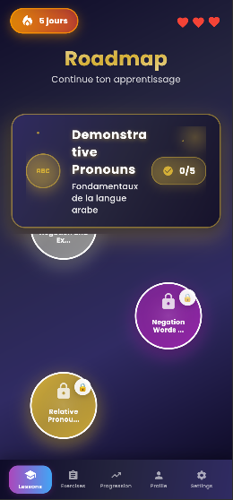
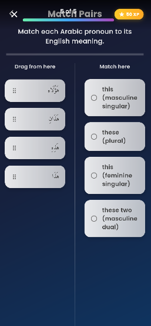
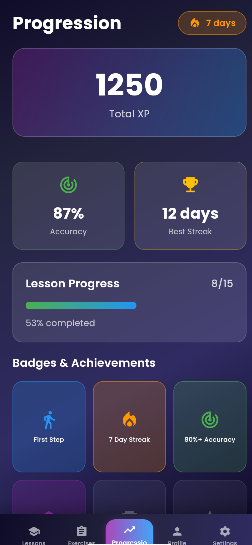
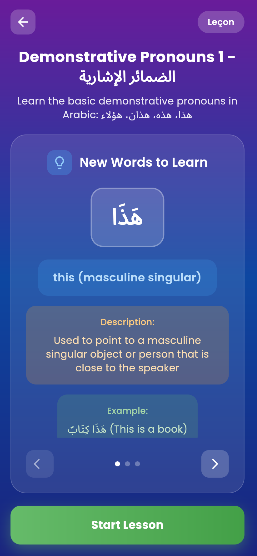
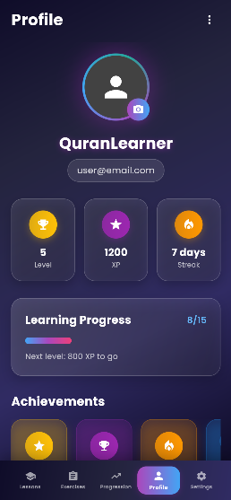
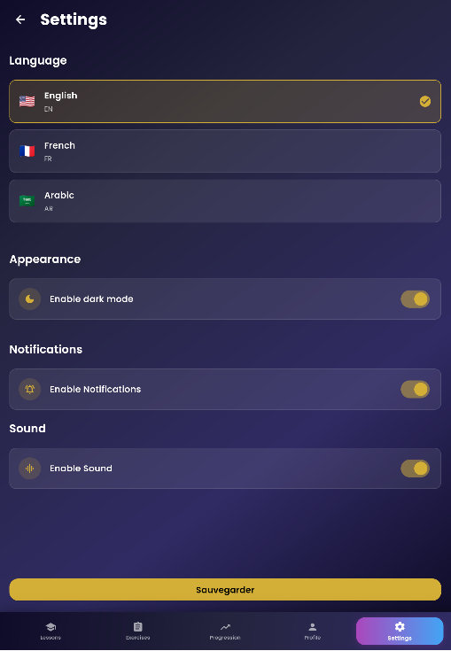

# 📸 Guide pour Ajouter des Captures d'Écran au README

Ce guide vous explique où et comment ajouter des captures d'écran pour améliorer la présentation de votre projet.

## 📁 Structure Recommandée

Créez un dossier `screenshots/` à la racine du projet :

```
dualingocoran/
├── screenshots/
│   ├── 01-roadmap.png
│   ├── 02-lesson-preview.png
│   ├── 03-exercises.png
│   ├── 04-progression.png
│   ├── 05-profile.png
│   ├── 06-settings.png
│   └── 07-login.png
└── README.md
```

## 📱 Captures d'Écran Recommandées

### 1. 📚 Écran Roadmap (01-roadmap.png)

**Quoi capturer :**
- L'écran principal avec la roadmap des leçons
- Les bulles animées représentant les leçons
- Le chemin de progression sinueux
- Le header avec le streak (jours consécutifs) et les vies
- La bannière de section active avec son icône et sa progression

**Points importants :**
- Prendre la capture en mode paysage si possible pour mieux voir le chemin
- S'assurer que plusieurs leçons sont visibles (complétées, en cours, verrouillées)
- Capturer avec le mode sombre ET le mode clair pour montrer les deux thèmes

**Emplacement dans le README :**
Section "Caractéristiques" → "Roadmap Interactive"

---

### 2. 📖 Aperçu d'une Leçon (02-lesson-preview.png)

**Quoi capturer :**
- L'écran d'aperçu d'une leçon avant de commencer
- Le titre et la description de la leçon
- La liste du vocabulaire avec les mots arabes et leurs traductions
- Le bouton "Commencer la leçon" / "Start Lesson"
- Les informations de la section (icône, titre, description)

**Points importants :**
- Montrer au moins 3-4 mots de vocabulaire avec leurs traductions
- Capturer l'animation de transition si possible
- Afficher les exemples d'utilisation des mots

**Emplacement dans le README :**
Section "Caractéristiques" → "Système d'Exercices"

---

### 3. 🎯 Exercices Interactifs (03-exercises.png)

**Quoi capturer :** Créez plusieurs captures pour montrer les différents types :

#### 3a. Exercice Choix Multiple
- Question affichée
- Options de réponse
- Feedback visuel (couleur verte/rouge)

#### 3b. Exercice Pairs/Associations
- Deux colonnes avec éléments à associer
- Lignes de connexion (si visibles)
- État initial et/ou en cours de complétion

#### 3c. Exercice Glisser-Déposer
- Zone de dépôt
- Éléments à glisser
- Feedback après dépôt

#### 3d. Exercice Audio
- Bouton de lecture audio
- Question liée à l'audio
- Options de réponse

**Points importants :**
- Créer une image montage avec 2-3 types d'exercices côte à côte
- OU créer des captures séparées et les organiser en grille
- Montrer les animations et feedbacks visuels

**Emplacement dans le README :**
Section "Caractéristiques" → "Système d'Exercices"

---

### 4. 📊 Écran de Progression (04-progression.png)

**Quoi capturer :**
- Le tableau de bord avec toutes les statistiques
- Graphiques de progression (si disponibles)
- Pourcentage de complétion
- Nombre de leçons complétées
- Points d'expérience (XP)
- Streak actuel
- Temps d'étude total

**Points importants :**
- Capturer avec des données réalistes (pas vides)
- Montrer différents types de graphiques/statistiques
- Inclure les badges ou réalisations s'ils existent

**Emplacement dans le README :**
Section "Caractéristiques" → "Suivi de Progression"

---

### 5. 👤 Écran de Profil (05-profile.png)

**Quoi capturer :**
- Photo de profil ou avatar
- Nom d'utilisateur
- Informations personnelles
- Statistiques d'apprentissage résumées
- Boutons d'action (modifier le profil, paramètres, etc.)

**Points importants :**
- Utiliser un profil de démonstration avec des données réalistes
- Montrer les informations personnalisables

**Emplacement dans le README :**
Section "Caractéristiques" → "Profil Utilisateur"

---

### 6. ⚙️ Écran des Paramètres (06-settings.png)

**Quoi capturer :**
- Liste des paramètres disponibles
- Sélecteur de langue (FR/EN/AR)
- Toggle pour le mode sombre
- Paramètres de notifications
- Paramètres audio
- Bouton de déconnexion

**Points importants :**
- Capturer avec différentes langues pour montrer la traduction
- Montrer le toggle mode sombre/clair
- Afficher tous les paramètres disponibles

**Emplacement dans le README :**
Section "Caractéristiques" → "Paramètres"

---

### 7. 🔐 Écran d'Authentification (07-login.png)

**Quoi capturer :**
- Écran de connexion avec champs email/mot de passe
- Bouton "Connexion avec Google"
- Lien vers l'inscription
- Design moderne avec logo/bannière de l'app

**Points importants :**
- Montrer les deux écrans (connexion et inscription) ou créer un montage
- Capturer l'interface élégante et moderne

**Emplacement dans le README :**
Section "Caractéristiques" → "Authentification"

---

## 🎨 Bonnes Pratiques pour les Captures

### Résolution et Format
- **Format** : PNG (meilleure qualité) ou JPEG (taille réduite)
- **Résolution** : Minimum 1080x1920 pour mobile (portrait) ou 1920x1080 (paysage)
- **Ratio** : Respecter le ratio de l'appareil (9:16 pour portrait, 16:9 pour paysage)

### Qualité
- ✅ Captures nettes et claires
- ✅ Contraste élevé pour la lisibilité
- ✅ Éviter les informations sensibles (emails réels, mots de passe)
- ✅ Utiliser des données de démonstration réalistes

### Présentation
- 📱 **Pour mobile** : Ajouter des bordures d'appareil (optionnel, mais plus professionnel)
- 🖼️ **Taille dans README** : Réduire à 800-1200px de largeur max
- 🎨 **Consistance** : Utiliser le même thème (clair ou sombre) pour toutes les captures

### Outils Recommandés
- **Pour mobile** :
  - Android : Outils de développement Android Studio
  - iOS : Simulateur iOS avec capture d'écran
- **Pour montage** :
  - [Figma](https://www.figma.com/) - Montage et annotations
  - [Canva](https://www.canva.com/) - Création de montages
  - [Photoshop](https://www.adobe.com/products/photoshop.html) - Retouche avancée
  - [GIMP](https://www.gimp.org/) - Alternative gratuite

---

## 📝 Comment Ajouter les Captures au README

Une fois les captures créées, ajoutez-les dans le README comme suit :

### Option 1 : Section Dédiée (Recommandé)

```markdown
## 🎨 Captures d'Écran

<div align="center">

### Écran Principal

*Roadmap interactive avec leçons organisées en sections*

### Exercices Interactifs

*Différents types d'exercices pour un apprentissage complet*

### Progression

*Suivi détaillé de votre progression et statistiques*

</div>
```

### Option 2 : Grille de Captures

```markdown
## 🎨 Captures d'Écran

<div align="center">

| Roadmap | Aperçu Leçon | Exercices |
|---------|--------------|-----------|
|  |  |  |

| Progression | Profil | Paramètres |
|-------------|--------|------------|
|  |  |  |

</div>
```

### Option 3 : Dans les Sections Appropriées

Ajoutez les captures directement dans les sections correspondantes :

```markdown
### 📚 Roadmap Interactive
- Parcours d'apprentissage organisé en sections
- Visualisation en bulles animées


### 🎯 Système d'Exercices
L'application propose plusieurs types d'exercices...


```

---

## 🚀 Étapes pour Créer les Captures

1. **Préparer l'Environnement**
   ```bash
   # Lancer l'application en mode release pour de meilleures performances
   flutter run --release
   ```

2. **Créer le Dossier**
   ```bash
   mkdir screenshots
   ```

3. **Capturer les Écrans**
   - Utilisez les outils de capture de votre plateforme
   - Nommez les fichiers selon la convention : `01-roadmap.png`, `02-lesson-preview.png`, etc.

4. **Optimiser les Images** (optionnel mais recommandé)
   ```bash
   # Installer ImageOptim ou utiliser un outil en ligne
   # Réduire la taille tout en gardant la qualité
   ```

5. **Ajouter au README**
   - Mettez à jour la section "🎨 Captures d'Écran" dans le README
   - Vérifiez que tous les liens fonctionnent

6. **Commit et Push**
   ```bash
   git add screenshots/
   git add README.md
   git commit -m "docs: Add screenshots to README"
   git push
   ```

---

## 💡 Astuces Supplémentaires

### Captures Animées (GIF)
Pour montrer les animations, créez des GIFs :
- Outils : [LICEcap](https://www.cockos.com/licecap/), [Kap](https://getkap.co/)
- Montrer : Transitions entre écrans, animations de bulles, interactions utilisateur

### Vidéos de Démonstration
Pour une présentation encore plus complète :
- Créer une courte vidéo de démonstration (1-2 minutes)
- Uploader sur YouTube ou Vimeo
- Ajouter le lien dans le README

### Screenshots avec Annotations
Ajoutez des flèches ou annotations pour expliquer les fonctionnalités :
- Utilisez Figma ou Canva pour ajouter des annotations
- Mettez en évidence les éléments importants

---

## ✅ Checklist Finale

- [ ] Dossier `screenshots/` créé
- [ ] Toutes les captures recommandées prises
- [ ] Images optimisées (taille raisonnable)
- [ ] Données de démonstration utilisées (pas de données réelles)
- [ ] Section "Captures d'Écran" ajoutée au README
- [ ] Tous les liens fonctionnent
- [ ] Captures ajoutées au git (ou .gitignore configuré si trop volumineuses)
- [ ] README mis à jour et testé

---

**Bon travail ! 🎉 Des captures d'écran de qualité amélioreront considérablement la présentation de votre projet.**

